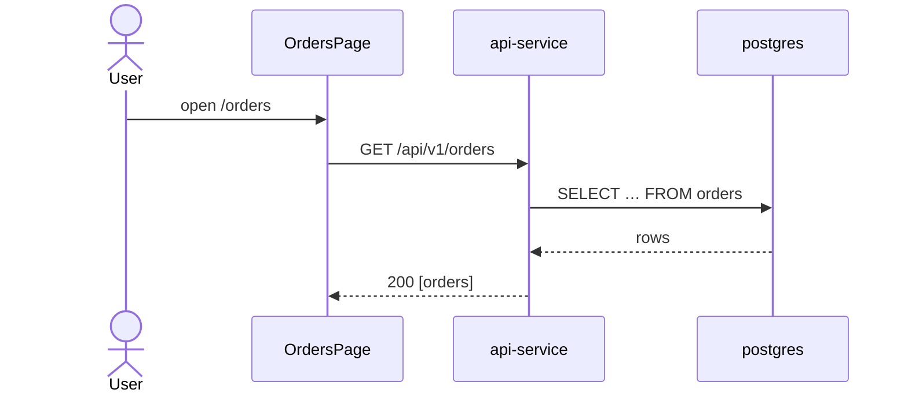
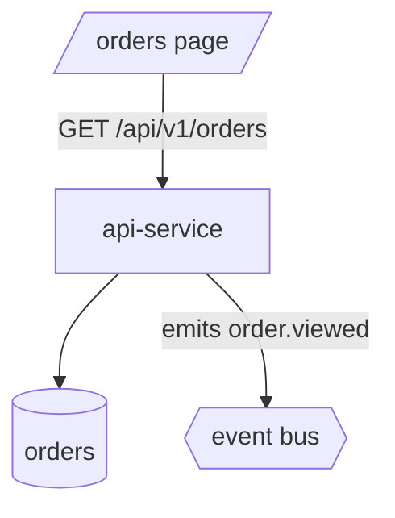

# sk-knowledge

Turn an investigation into a **durable, evidence-tracked knowledge entry** that future agents and
humans can trust — and later tell whether it is still true. One entry = one question answered. The
markdown file's frontmatter is the **canonical metadata**; the index, HTML, and staleness state are
all derived from it by the bundled engine, so the store self-heals from the markdown alone.

## Working folder — align scope, then resolve the store, first

Paths here are relative to the **active scope**, not your current directory. Settle the anchors once,
before any read or write:

```bash
ROOT="$PWD"; while [ "$ROOT" != "/" ] && [ ! -d "$ROOT/.sidekicks" ]; do ROOT="$(dirname "$ROOT")"; done
# (1) Explicit work_dir= wins: align scope to its projects/<project>/services/<service>/ segments
#     (node "$ROOT/bin/sidekicks" project use <p>; ... service use <s>), then WORKDIR=<work_dir>.
# (2) Else, handed a target path under projects/<p>/services/<s>/…? Align scope to it the same way.
# (3) Else resolve from the active scope as-is:
WORKDIR="$(node "$ROOT/bin/sidekicks" scope working-folder)"

# The knowledge STORE anchors at the artifacts base (service ROOT for a service — never src/;
# the project dir / repo root otherwise). knowledge_dir= overrides it outright:
KNOW="${knowledge_dir:-$(node "$ROOT/bin/sidekicks" scope artifacts-base)/.knowledge}"
KCTL="node $ROOT/.agents/skills/sk-knowledge/scripts/knowledge.mjs"
$KCTL init --dir "$KNOW"    # idempotent; prints the store's absolute path
```

Walk up for `.sidekicks/` — never `git rev-parse` (a service `src/` is its own git repo). The store
is **committed knowledge, not run state** — that is why it lives at `.knowledge/` beside the source,
not under `artifacts/runs/` (which is sweepable transient output). Every path persisted inside an
entry is **repo-relative**, never machine-absolute.

## Store layout

```
.knowledge/
  index.json          # machine index (derived — rebuild anytime with `reindex`)
  INDEX.md            # AI quick-scan index
  index.html          # human browse page
  entries/<slug>.md   # AI consumer — frontmatter is the canonical tracking metadata
  entries/<slug>.html # human consumer — metadata card + rendered document (the plain twin)
  reports/<slug>.html # SHAREABLE report — designed, self-contained, in `result_language`
```

Three derived files, one source. `entries/<slug>.html` is the **plain twin**: the metadata card over
the raw markdown, for reading and diffing. `reports/<slug>.html` is the **report**: the same finding
laid out to be handed to someone who will never open the markdown — a **TL;DR** first, unverified
caveats up top, composition tables drawn with proportion bars, theme-aware, prose in the configured
language.
Both regenerate from the entry markdown alone, so the store still self-heals from the `.md` files.

## The engine

Every structural operation goes through the bundled zero-dependency script — never hand-maintain
`index.json` or the HTML files:

| Verb | Does |
|---|---|
| `init` | ensure the store exists (idempotent) |
| `now` | print the Asia/Bangkok ISO timestamp to stamp into frontmatter |
| `snapshot <paths…> [--yaml]` | provenance for source files: repo, branch, commit, file_commit, sha256 — `--yaml` prints a paste-ready `sources:` block |
| `register <slug>` | validate frontmatter, render the HTML twin **and the report**, rebuild the index |
| `find [<terms…>] [--json]` | **existence probe across ALL stores in the repo** — one catalog read, no fs rescan, no `.md` reads; exit 0 = hits, 2 = nothing recorded; no terms = list stores |
| `list [--json] [--tag t] [--section s] [--stale]` | list entries |
| `search <terms…> [--json]` | rank entries matching terms across title/summary/tags/question/body |
| `show <slug> [--json]` | print the entry markdown (or metadata) |
| `check [<slug>…] [--json]` | rehash every file source, stamp `status`/`checked_at`, re-render twin + report; **exit 3 when anything is stale** |
| `render <slug>` / `reindex` | regenerate one entry's twin + report / rebuild everything from markdown |
| `report <slug>` | write `reports/<slug>.html` on an EXPLICIT ask — works even with `always_generate: false` |
| `remove <slug>` | delete an entry — md, twin **and report** (only on an explicit user ask — git history keeps it recoverable, which is exactly why the slug must name an entry *in the store*: the shape is enforced) |

All verbs take `--dir "$KNOW"`. Every rendering verb also takes `--report` / `--no-report` (force or
suppress the report for this run, over the config) and `--lang <language>` (override
`result_language`). `--no-report` **deletes** an existing report rather than leaving it: a stale
report carries nothing on its face that says it no longer matches the entry.

## Configuration

Three keys in the `knowledge` block. Read them once, at the start of a run — never by parsing YAML:

```bash
node "$ROOT/bin/sidekicks" config get knowledge --json    # .config.{always_generate,confirm_before_generate,result_language}
```

| key | default | meaning |
|---|---|---|
| `always_generate` | `true` | write the report on every CAPTURE / TRACE / REFRESH. `false` = only on an explicit ask (`report <slug>`, or `--report`) |
| `confirm_before_generate` | `false` | `true` = ask the user before writing the report. **This is yours to honour** — the engine cannot ask anyone, so it ignores this key entirely |
| `result_language` | `Thai` | the language the report's PROSE is written in |

The block lives in the `skills` family and `inherits_root`, so one setting at root governs every
project. A missing config is never an error: every layer falls back to the skill's bundled
`config.defaults.yaml`, and a copy of this skill lifted into a repo with no CLI still renders.

**`result_language` selects prose; it never translates.** A deterministic Node generator cannot
translate — and the report MUST regenerate byte-identically from the entry markdown alone. So the
localized prose is something **you** author, as a `## Report (<lang>)` section inside the entry
markdown, next to the untouched body. The engine renders that section and the matching chrome
labels. Rules:

- **The entry markdown is not translated.** The body stays in whatever language it was written in;
  the report block is an addition, not a replacement.
- **Technical content stays verbatim inside the localized prose** — code, identifiers, column and
  table names, CLI commands, file paths, `file:line` citations, and exact error strings are never
  translated, whatever `result_language` says.
- **An entry with no report block still gets a report**: the engine derives the narrative from the
  entry's own sections and localizes only the chrome. That is what makes an old entry regenerate.
- Supported today: `Thai` (`th`) and `English` (`en`); any other value falls back to English labels.

## Mode selection

- **LOOKUP** — "what do we know about X", "show the knowledge", "list/search the knowledge base".
- **CAPTURE** — "investigate/distill/record X", or you just finished a deep investigation worth keeping.
- **TRACE** — a UI page/route or API endpoint is the target: "trace this page", "map UI to API",
  "sequence diagram for endpoint Y". A specialized CAPTURE with a mandatory output shape (below).
- **REFRESH** — "is it still current", "the code changed, update the knowledge", or `check` reports stale.

**Lookback-first is a hard habit — and it is CHEAP:** before ANY new investigation, run
`$KCTL find <terms>` (no `--dir` needed — it probes **every** store in the repo from the derived
catalog: one JSON read plus mtime validation, no filesystem rescan, no entry reads; exit 2 means
nothing exists anywhere). A `fresh` hit answers from the entry (cite it — `find` prints the md
path). A `stale` hit routes to REFRESH instead of a from-scratch capture. Only exit 2 starts a new
CAPTURE. Use `search --dir "$KNOW"` only when you need deeper in-store matching (it also greps
entry bodies). The catalog lives at `artifacts/runs/_adhoc/sk-knowledge/catalog.json` — the
work-item-less shape (runs layout v2), fixed at the repo ROOT and never scope-resolved, since it
indexes every `.knowledge/` store in the repo rather than one project's — a
git-ignored derived cache kept warm by every `register`/`check`/`remove`. Deleting it is safe:
the next `find` rediscovers every store at a canonical `.knowledge/` location (repo root, project
dirs, service roots — bounded readdirs, no tree walk); a store at a custom `knowledge_dir` re-enters
on its next write-through (`reindex --dir <it>` re-adds it immediately). A catalog built before runs
layout v2 stays frozen at `artifacts/runs/sidekicks-knowledge/catalog.json` — `find` reads it as a
one-time fallback when the v2 catalog is missing, but every write lands only at the v2 path above.

## CAPTURE — investigate, then record

1. **Decide where the knowledge lives — yourself.** The ask names a topic, not a location. Pick the
   evidence surfaces that can actually answer it: source under `$WORKDIR` (grep/read), git history,
   existing docs and BMAD artifacts, the project config, a database (reads via
   `sk-database-connector` — prod only via the Teleport skills), external facts via the
   `sk-fable-researcher` seat. Rule 5 applies in full: every claim in the entry must trace to
   evidence you actually observed — grep hits, file reads, query results — never intuition.
2. **Investigate and distill.** Answer the question completely but leanly; the entry is a reference
   document, not a transcript.
3. **Stamp provenance.** `TS="$($KCTL now)"` and
   `$KCTL snapshot --dir "$KNOW" --yaml <every file you relied on>` — the output is the exact
   `sources:` block for the frontmatter. Non-file evidence gets a manual list item
   (`type: url|db|command`, `ref:`, `note:` — include what/when).
4. **Author `entries/<slug>.md`** (slug: short kebab-case of the topic — **enforced**: every
   slug-taking verb rejects anything outside `[a-z0-9][a-z0-9-]*` with exit 1, because the slug is
   joined straight into a path and `remove` deletes what that join resolves to) with this exact
   frontmatter
   shape — the parser is deliberately simple, so keep scalars single-line (quote if they contain `:`),
   tags as a flow list, sources as the snapshot block:

   ```markdown
   ---
   id: <slug>
   title: <one-line title>
   question: "<the original ask, verbatim or tightened>"
   summary: "<one-sentence answer — this is what the index shows>"
   section: <index section — general | ui | api | architecture | data | ops>
   target: "<optional — the concrete route/endpoint this entry maps, e.g. /orders or GET /api/v1/orders>"
   tags: [<topic>, <area>]
   scope: <repo-relative scope, e.g. projects/shp-sk/services/api>
   status: fresh
   created_at: <TS>
   updated_at: <TS>
   captured_branch: <branch of the source repo at capture>
   captured_commit: <HEAD commit of the source repo at capture>
   sources:
     - path: <repo-relative file>
       repo: <repo-relative git root of that file ('.' = this repo)>
       branch: <branch>
       commit: <repo HEAD>
       file_commit: <last commit touching the file>
       sha256: <content hash>
   ---

   # <title>

   <the distilled knowledge: findings, how it works, the evidence — with file:line citations>

   ## Evidence

   <what you observed and where: the greps, reads, queries that ground each claim>

   ## Revision log

   | date | branch @ commit | change |
   |---|---|---|
   | <TS> | <branch> @ <short commit> | initial capture |
   ```

5. **Write the report block** — the shareable half of the entry, and the step most easily skipped.
   Resolve the gate first: `config get knowledge --json`. `always_generate: false` and no explicit
   ask means skip this step; `confirm_before_generate: true` means ask the user before writing it
   (the engine cannot ask — this gate is yours). Otherwise append to the same `.md`, in
   `result_language`:

   ```markdown
   ## Report (th)

   ### คำตอบ
   <the one-sentence answer, in result_language>

   ### สิ่งที่พบ
   <the substantive findings, with their real numbers — a count split across categories goes in a
   table and gets proportion bars automatically>

   ### สิ่งที่แก้จากสมมติฐานเดิม
   <what the question assumed that turned out wrong — omit the heading if it assumed nothing>

   ### ยังไม่ได้ตรวจสอบ
   <every claim you could NOT verify — omit only if there is genuinely nothing>
   ```

   **The TL;DR is composed for you** — the engine leads the page with a TL;DR panel built from the
   question plus `### คำตอบ`, flagged when a caveat exists, so every report has one and you write
   nothing extra. Add an explicit `### TL;DR` subsection only when the headline is NOT simply the
   answer — a trace whose real point is "three of the five hops are unverified", say; it then wins
   over the composed one. Either way the question and answer are not repeated further down.

   The heading names are yours to localize; the engine matches on meaning, and an English
   `### Answer` / `### TL;DR` / `### Corrections` / `### Not verified` works identically. Everything technical stays
   verbatim inside that prose (see Configuration). **Never drop the "not verified" section to make
   the report read better** — it is rendered as a callout above the findings precisely because that
   is the part a polished summary loses.

6. **Register:** `$KCTL register <slug> --dir "$KNOW"` — validates the frontmatter, writes the HTML
   twin and the report, rebuilds `index.json`/`INDEX.md`/`index.html`.
7. **Answer the user** with the answer itself plus all three file paths (repo-relative) and remind
   that `.knowledge/` is meant to be committed so the knowledge travels with the repo (commit via
   the normal flow — don't auto-commit).

Mermaid works everywhere: a ` ```mermaid ` fence in any entry renders as a live diagram in the HTML
twin (client-side; offline the source stays visible as readable text — never a blank box).

## TRACE — UI page / API endpoint vision mapping

A TRACE entry answers "how does this page/endpoint actually work, end to end" — and because every
file on the path is a tracked source, `check` later tells you the moment any hop of the mapping
goes stale. It is a CAPTURE with a fixed investigation method and output shape.

**Investigate — follow the real call path, never the imagined one (Rule 5):**

1. **Resolve the target to code.** A UI route → the page component via the framework's router
   convention (Next.js `app/`/`pages/`, react-router config, …). An endpoint → its route
   registration/handler (grep the method + path across every service under the project).
2. **UI side (when the target is a page):** walk the component tree from the page down (imports,
   composition). For each meaningful component collect its **display conditions** — conditional
   rendering (`&&`, ternaries, early returns), permission/role checks, feature flags, loading/empty/
   error states — each with a `file:line` citation. Then collect every **API call** the tree makes
   (fetch/axios/client wrappers, react-query/SWR hooks, server actions): trigger (mount, click,
   submit, poll), method + endpoint, and payload essentials.
3. **API side (both target kinds):** for each endpoint, find its handler and trace what it touches —
   internal modules, **other services** (HTTP clients, queues, events), DB tables/queries, external
   vendors. For an endpoint target, also reverse-map its **consumers**: grep the path across UI code
   and sibling services so the entry shows who depends on it.
4. **Draw only verified edges.** Every arrow in a diagram must have a citation behind it; a hop you
   suspect but could not confirm goes in an "Unverified" note under Evidence, never in the diagram.
5. **Stop at the scope boundary sensibly.** Cross-service hops inside the project are in scope;
   third-party internals are a labeled terminal node (`ExtPayment[Stripe]`), not a guess.

**Author with this shape** (frontmatter: `section: ui` for a page target, `section: api` for an
endpoint target; `target:` set to the route/endpoint; sources = every file the trace relied on —
page, components, hooks, handlers, service clients). **Escape a literal pipe inside a table cell as
`\|`** — including inside inline code, which is where it bites: a display condition like
`` `a || b` `` written unescaped splits the row into extra cells and drags the surrounding `<code>`
across cell boundaries in the HTML twin. The renderer unescapes `\|` back to `|`; note that a shell
command using `\|` as grep alternation is therefore rewritten to `|` inside a table cell — put such
commands in a list item or code fence instead:

````markdown
# <route or METHOD /endpoint> — trace

## Overview
<two-or-three-sentence answer: what the page/endpoint does and who it talks to>

## Component display conditions        <!-- UI target -->
| component | source | displayed when |
|---|---|---|
| OrderTable | src/…/OrderTable.tsx:41 | `orders.length > 0 && !isLoading` |

## API calls
| trigger | request | handler | purpose |
|---|---|---|---|
| page load | GET /api/v1/orders | services/api/src/routes/orders.ts:18 | list orders |

## Service relations                    <!-- API target: consumers + downstream -->
<who calls this endpoint; what it calls in turn — services, queues, DB tables>

## Sequence diagram


## Flow diagram


## Evidence
## Revision log
````

Then add the `## Report (<lang>)` block exactly as CAPTURE step 5 describes — for a TRACE the
findings are the display conditions, the API call table and the service relations, and the caveat
section is where the hops you could NOT confirm go (they are barred from the diagrams, so the report
is the only place a reader learns they exist). Then `register` as usual — the index files a
`ui`/`api` section automatically, the html twin renders both diagrams live, and the report carries
them too.

## REFRESH — when the source of truth moved

1. `$KCTL check --dir "$KNOW"` (or `check <slug>`) — rehashes every tracked file; drifted or missing
   sources mark the entry `stale` (exit 3) and the report names exactly which sources changed and
   from/to which commit.
2. For each stale entry: **re-investigate only the drifted sources** — read what changed (the
   `file_commit` pair bounds a `git log`/`git diff` if useful), then update the body where the change
   invalidates it. If the knowledge is now simply wrong, rewrite it; if unchanged in substance, say so.
3. Update the frontmatter: fresh `snapshot --yaml` sources block, `updated_at: $($KCTL now)`, new
   `captured_branch`/`captured_commit`, `status: fresh`; append a **Revision log** row saying what
   changed and why.
4. **Refresh the report block too.** A body that changed and a `## Report (<lang>)` section that
   did not is a report that now lies. Update it under the same gate as CAPTURE step 5, and move any
   caveat the refresh resolved out of "not verified" into the findings.
5. `$KCTL register <slug> --dir "$KNOW"` and report which entries were refreshed vs. confirmed-unchanged.

Run `check` opportunistically whenever the user asks whether knowledge is current, before answering
from an entry that matters, and at the start of a REFRESH ask like "update the knowledge base".

## LOOKUP

`list` for a browse, `search <terms>` for a question, `show <slug>` for the full entry. Answer from
the entry body, cite it (`.knowledge/entries/<slug>.md`), and surface its status — if `stale`, say so
and offer a REFRESH before relying on it. Point humans at the `.html` twin / `index.html`.

## Boundaries and safety

- **Not `sidekicks memory`.** A one-line decision/convention still goes through
  `sidekicks memory add`; a knowledge entry is a distilled *document* with tracked evidence. When an
  investigation yields both, do both — and link the memory to the entry path.
- **Investigation is read-only.** Never mutate anything while gathering evidence. DB reads follow the
  standing rules (Rule 4 gates any write; prod only through the Teleport skills).
- **The markdown is canonical.** Edit knowledge in the `.md`, then `register`/`reindex` — never
  hand-edit `index.json` or any `.html`. That includes the report: `reports/<slug>.html` is DERIVED,
  it regenerates byte-identically from an unchanged entry, and any edit made to it directly is
  destroyed by the next `register`. The localized prose lives in the entry's `## Report (<lang>)`
  section, which is why it survives.
- **Portable paths — never machine-absolute, enforced.** Knowledge is committed and consumed on
  other machines and clones, so every path persisted anywhere in an entry — frontmatter `scope`/
  `sources`, body citations, diagram labels — is **repo-relative** (`.` = repo root), never
  `/Users/…`, `/home/…`, or `C:\…`, and never `../`-escaping the repo. `snapshot` already emits the
  portable form (and refuses a file outside the repo — record external evidence as a
  `type: url|db|command` source instead); `register` **hard-fails** on an unportable frontmatter
  path and warns when the body cites a machine-local path. `$WORKDIR`/`$KNOW` absolutes are for
  *running* only — strip the root prefix before writing any path into an entry.
- **Cross-platform.** The engine is plain Node (`node …/knowledge.mjs`), safe on macOS and Windows;
  don't wrap it in POSIX-only shell tricks.
